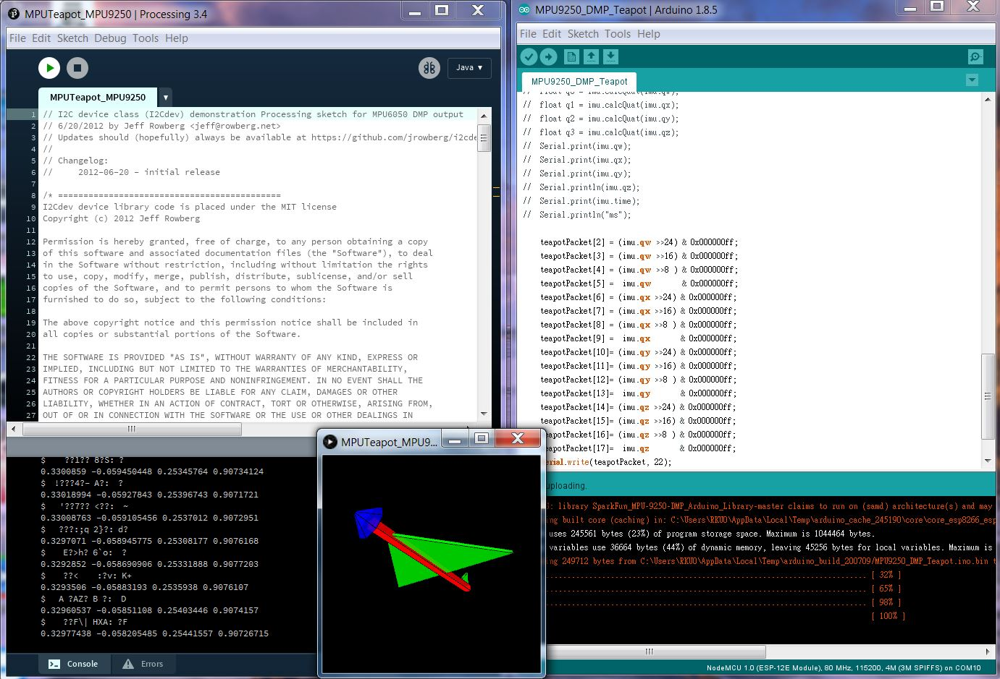

# Arduino sample codes
## Demo

## examples
**BMP085** : *BMP085 is an atomphere pressure sensor (I2C)* 
**DHT22** : *DHT22 is humidity and temperature sensor* 
**DS18B20** : *DS18B20 is a temperature sensor* 
**GSR** : *GSR is a galvanic skin response sensor (Analog)* 
**GY-953** : *GY-953 is STMicro IMU output ypr (UART)* 
**HC-SR04** : *SR04 is an ultrasonic ranger (GPIO)* 
**HC05** : *use Software UART to read/write HC05 Bluetooth serial* 
**HMC5883L** : *HMC5883 is a magnetometer / electronic compass (I2C)* 
**HTU21DF** : *HTU21DF is humidity and temperature sensor (I2C)* 
**MLX90614** : *MLX90614 infrared temperature sensor (I2C)* 
**MLX90614_OLED** : *Forehead Thermometer using MLX90614 + 0.91" OLED (I2C)* 
**OLED** : *0.91" OLED SSD1306 (I2C)* 
**PM5003** : *use Software UART to read PM5003 air quality sensor* 
**VL53L0X** : *VL53L0X infrared ranger ~1 meter(I2C)* 
**VL53L1X** : *VL53L1X infrared ranger ~2 meters(I2C)* 
**PWM_RGBLED** : *PWM driving RGB-LED* 
 
**MPU6050 & MPU9250 are IMUs including 3-axis accelerometer, 3-axis gyroscope, 3-axis magnetometer** 
**MPU6050_Calibration** : *MPU6050 calibration to get and set X,Y,Z offset value* 
**MPU6050_DMP_Teapot** : *MPU6050 DMP, support output MPUTeapot packet* 
**MPU6050_HMC5883_AHRS** : *MPU6050 + HMC5883 (GY-88 module) with Madgwick filter, support output MPUTeapot packet* 
**MPU6050_KalmanFilter** : *MPU6050 Kalman Filter to get pitch and roll* 
**MPU9250_BasicAHRS2** : *MPU9250 with Madgwick filter, support output MPUTeapot packet* 
**MPU9250_DMP_Teapot** : *MPU9250 DMP, support output MPUTeapot packet* 
*(MPUTeapot.pde will render a 3D object to show AHRS in Processing)* 
 
**ESP32CAM_CamWebServer** : *ESP32-CAM Camera Web Server* 
**ESP32_ADC** : *ESP32 ADC accuracy improvement function* 
**ESP32_BLE_Gamepad** : *ESP32 BLE Gamepad test* 
**ESP32_DAC_Audio** : *ESP32 DAC Audio output* 
**ESP32_DAC_Audio_MultiSound** : *ESP32 DAC Audio output multiple .wav sound* 
**ESP32_Google_TTS** : *ESP32 Google TTS get speech url* 
**ESP32_IRreceiver** : *ESP32 IR remote receiver* 
**ESP32_IRsender** : *ESP32 IR remote sender* 
**ESP32_I2S_MEMS** : *ESP32 I2S INMP441 MEMS microphone* 
**ESP32_ROS** : *ESP32 ROS serial* 
**ESP32_TFlite_micro_speech** : *ESP32 TFlite micro speech* 
**ESP32_Webclient_IoT_HTU21DF** : *ESP32 Webclient for IoT with HTU21DF* 
**ESP32_Webserver_GPIO** : *ESP32 Webserver control two GPIO pins* 
**ESP32_Webserver_IoT** : *ESP32 Webserver for IoT* 
**ESP32_Webserver_Ngrok** : *ESP32 Webserver for ngrok TCP tunnelling* 
**ESP32_WiFi_Radio** : *ESP32 WiFi Radio (using MAX998357)* 
**ESP32_WiFi_TelnetToSerial** : *ESP32 WiFi Telnet to Serial port* 
**EspCopter32** : *ESP32 Quadcopter* 
 
**NodeMCU_Audio_Wav** : *NodeMCU play audio .wav file* 
**NodeMCU_NTP_RTC** : *NodeMCU Real-Time Clock reading Network Time Server* 
**NodeMCU_RoboCar_TB6612** : *NodeMCU output PWM to TB6612 to control two wheels(3~6V DC motors x2)* 
**NodeMCU_RoboCar_WebUI** : *NodeMCU WebUI to control two wheels* 
**NodeMCU_servo** : *NodeMCU drive DC servo* 
**NodeMCU_RoboCar_PID** : *NodeMCU PID controller to output PWM driving TB11612* 
**NodeMCU_Webclient_DHT22** : *NodeMCU read DHT22 sensor and send data to Webserver* 
**NodeMCU_Webclient_TU21DF** : *NodeMCU read HTU21DF sensor and send data to Webserver* 
**NodeMCU_Webclient_PM5003** : *NodeMCU read PM5003 sensor and send data to Webserver* 
**NodeMCU_Webserver** : *NodeMCU running Webserver to receive sensor from http client* 
**NodeMCU_Webserver_GPIO** : *NodeMCU running Webserver and use use GPIOs to control LEDs* 
**NodeMCU_Webserver_OLED** : *NodeMCU running Webserver and use I2C OLED display (SSD1306)* 
**NodeMCU_Webserver_Remote** : *NodeMCU running Webserver to send IR remote signals to a cablebox* 
**NodeMCU_Wemo** : *NodeMCU emulate a Wemo switch (smarthome switch)* 
**NodeMCU_Wemos** : *NodeMCU emulate several Wemo switches (smarthome switches)* 
**NodeMCU_coapclient** : *NodeMCU run as CoAP client* 
**NodeMCU_coapserver** : *NodeMCU run as CoAP server* 
**NodeMCU_MQTTBroker** : *NodeMCU run as a MQTT Broker* 
**NodeMCU_mqtt_DHT22** : *NodeMCU run as a MQTT publisher with DHT22* 
**NodeMCU_mqtt_pub** : *NodeMCU run as a MQTT publisher* 
**NodeMCU_mqtt_pubsub** : *NodeMCU run both MQTT publisher and subscriber* 
**NodeMCU_mqtt_sub** : *NodeMCU run as a MQTT subscriber* 
**NodeMCU_thingspeak_DHT11** : *NodeMCU read DHT11 sensor data and upload to Thingspeak.com* 

## libraries (used by examples)
**Adafruit-GFX-Library.zip** : *Graphics library for OLED/LCD display* 
**Adafruit_HTU21DF.zip** : *HTU21DF Temperature & Humidity sensor library* 
**Adafruit_SSD1306.zip** : *I2C OLED display library* 
**Adafruit_Sensor.zip** : *Adafruit_Sensor.h for DHT11* 
**DHT.zip** : *DHT Temperature and Humidity sensor library* 
**ESP32-audioI2S.zip** : *ESP32 Audio I2S Library* 
**ESP32-BLE-Gamepad.zip** : *ESP32 BLE Gamepad Library* 
**ESP8266Audio.zip** : *ESP8266 Audio library* 
**ESP8266_Spiram.zip** : *ESP8266 SPI RAM library* 
**HMC5883L.zip** : *HMC5883L magnetometer library* 
**IRremoteESP8266.zip** : *ESP8266 IR Remote library* 
**MPU6050.zip**: *MPU6050 DMP library* 
**MPU9250-DMP.zip** : * MPU9250 DMP library* 
**PubSubClient-2.7.0.zip** : * MQTT client library* 
**Time.zip** : *timer library* 
**TimeAlarms-1.5.0.zip** : *timer alarm library* 
